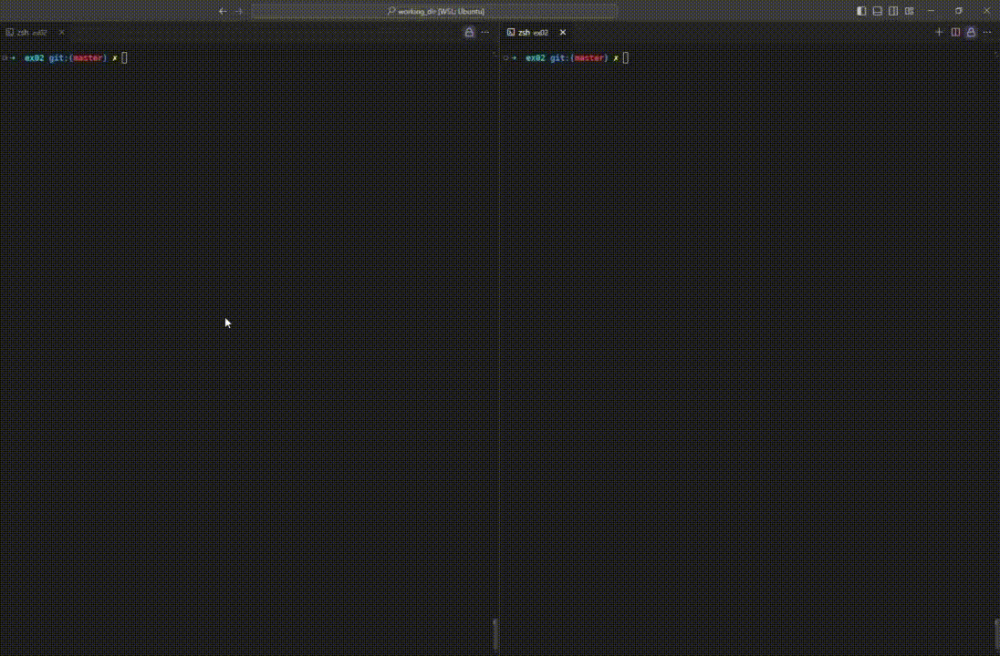

# PmergeMe

PmergeMe는 Ford-Johnson 병합-삽입 정렬 알고리즘을 구현한 C++ 프로그램입니다.

## 특징

- Ford-Johnson 병합-삽입 정렬 알고리즘 구현
- 비교 횟수를 최소화하여 효율적인 정렬 수행
  -> 한 번의 비교가 많은 비용을 요구할 때 특히 효율적 (예: 테니스 토너먼트)
- 각 컨테이너 타입별 정렬 시간 측정 및 표시
- 잘못된 입력에 대한 오류 처리
- 추가 정렬 검증을 위한 옵션 디버그 모드

## 알고리즘 설명

Ford-Johnson 알고리즘(병합-삽입 정렬)은 비교 기반 정렬 알고리즘 중 이론적으로 가장 효율적인 알고리즘 중 하나입니다. 주요 특징:

1. **비교 횟수 최소화**: 
   -> 요소들을 특별한 순서로 비교하여 총 비교 횟수 감소

2. **재귀적 페어링**: 
   -> 요소들을 재귀적으로 페어로 나누고, 각 페어에서 더 큰 요소 선택

3. **주 체인과 펜딩 요소**: 
   -> 선택된 큰 요소들로 '주 체인' 형성, 나머지는 '펜딩 요소'로 분류

4. **이진 삽입**: 
   -> 펜딩 요소들을 주 체인에 효율적으로 삽입하기 위해 이진 검색 사용

5. **야코비안 시퀀스**: 
   -> 특별한 삽입 순서로 비교 횟수 추가 최적화

-> 시간 복잡도: O(n log n) (평균 및 최악의 경우)
-> 실제 비교 횟수: 다른 O(n log n) 알고리즘들보다 적음

## 성능 개선

최근 구현에서 삽입 로직을 개선하여 상당한 성능 향상을 달성했습니다. 약 15,000개의 난수 정렬을 기준으로 한 결과는 다음과 같습니다:

| 컨테이너 | 이전 성능   | 개선된 성능  | 성능 향상 |
|----------|-------------|--------------|-----------|
| Vector   | 1817.147ms  | 343.407ms    | 5.29배    |
| Deque    | 6166.778ms  | 1398.481ms   | 4.41배    |

이 개선은 재귀적 페어링 이후 삽입 과정에서 선형 탐색 대신 이진 탐색을 적용함으로써 이루어졌습니다.

## 특징

- Ford-Johnson 병합-삽입 정렬 알고리즘 구현
- std::vector와 std::deque 컨테이너를 사용하여 양의 정수 정렬
- 각 컨테이너 타입별 정렬 시간 측정 및 표시
- 잘못된 입력에 대한 오류 처리
- 추가 정렬 검증을 위한 옵션 디버그 모드

## 요구 사항

- C++98 표준을 지원하는 C++ 컴파일러
- Make

## 컴파일

제공된 Makefile을 사용하여 프로그램을 컴파일하세요: